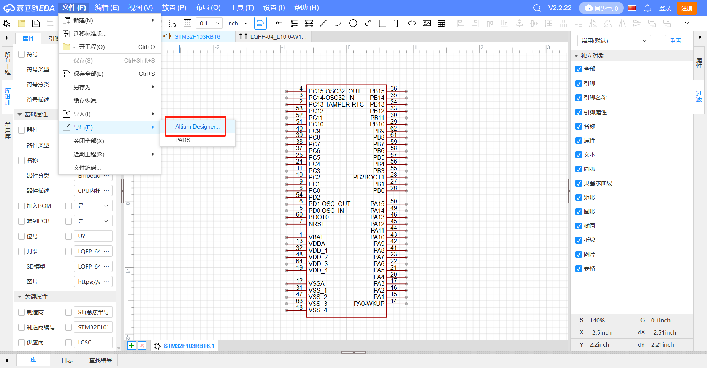

# 2025-北航机器人队电控方向招新
## 前言

本测试题用于北京航空航天大学机甲大师Transistor战队电控组的入队考核过程，我们希望有更多的同学能够加入队伍，因此每周的考核将分为基础篇与进阶篇两部分，其中基础部分的题目基于**培训内容**和**平时所学内容**，进阶部分的题目难度将会**略微**超过本科期间的**正常**知识范畴，两部分都需要大家尽力完成。

电控组分为偏**控制**和偏**硬件**两个两个，其中电控-控制主要负责整车的控制和调试工作，电控-硬件主要负责PCB电路板的设计绘制以及超级电容等关键电器元件的设计。在测试题中，会存在**偏控制或偏硬件方向**两个方向的题目，大家根据自己之前的偏向**选择性做题**，部分选做，请大家仔细阅读题目，并按照要求格式提交测试答案。

## 请注意：

1. 考核为期**2周**，每周都会发放一定数量的题目，并要求在**当周内提交**，提交时间将在上一周末与答题卡同步在群内下发。
2. 每个组别基础部分的题目要求全部完成，进阶部分的题目不是必须全部完成的，请各位尽力而为。
3. 提交方法包括**发送至邮箱**、**使用github提交**等，不同考核题的提交方法会在每周任务发布的同时公布。请大家按照规定格式提交，以方便阅卷。
4. 编程类型的题目需要有一定的可读性，并包含一定的**注释**。
5. 了解其他组别的题目有助于各位更好地获取机器人方向的知识。
6. **不可互相抄袭！**如果我们发现有同学的提交内容高度雷同，经查验发现有互相抄袭情况的存在，将取消考核资格！我们在考核期更看重的是面对问题和挑战的态度，是否具有一定独立的思考，而非最后的结果。
## 初心高于胜负，希望各位经过之前的培训能够通过考核加入Transistor战队！

# 第一周

## 基础篇

### 软件安装

**任务要求**

- keil5、vscode(主要软件）参加过培训的同学理应已经安装完成，此处不在赘述。

**软件官网**

- [keil官网下载](https://gitee.com/link?target=https%3A%2F%2Fwww.keil.com%2Fdownload%2Fproduct%2F)
- [vscode官网下载](https://gitee.com/link?target=https%3A%2F%2Fcode.visualstudio.com%2F)

### github基本操作

**任务简介**

- GitHub是一个开源的分布式版本控制系统，用于敏捷高效地处理任何或小或大的项目,可以帮助你进行自动的版本管理。控制组之后的线上测试都是通过github发布，在多人协作的情况下，使用github就会相当的方便，能够有效地协调多位开发者对不同地方的改动。
- Transistor电控组使用github来协作编写代码，上传工作日志。

**任务要求**

- 安装Git，并注册github账户，并在**7月1号-7月3号**两天之内将用于注册github账户的邮箱号发送到**1542701750@qq.com**里，我们会把大家添加为仓库的协作者，之后的一些任务就在github里直接提交。
- 特别强调：务必在**7月3号**之前完成上述操作，**逾期视为自动退出考核**。
- 在想要克隆本仓库的地方，右键菜单点击“**`Git Bash Here`**”，输入以下代码，即可实现将远程仓库克隆到本地的操作，注意**之后的任务会放置在任务文件夹中**（**参考教程里会讲到，学习即可**）
- 具体任务
  1. 创建一个markdown文件，命名格式为{**{学号}{你的名字}LearnMarkdown.md**}，如‘233xxxx6小飞LearnMarkDown.md’,写出简单的markdown语法使用（deepseek自学即可）。
  2. 创建一个markdown文件，命名格式为{**{学号}{你的名字}.md**}，如‘233xxxx6小飞.md’，撰写你对本周题目的难度的看法/自己认为的难点。
  3. 创建一个markdown文件，命名格式为{**{学号}{你的名字}LearnGit.md**}，如‘233xxxx6小飞LearnGit.md’，简述自己对**git组成以及常见命令使用原理的理解**。
- 三个文件统一放在‘Electrical-Control\第一周测试题提交’里。
- `git commit -m {改动的内容}` 在这里写清这次提交改动的内容:**{你的名字}提交git操作**。
- 本任务结果提交方式为**git（github）提交** （**因为要先成为协作者才能够提交，所以具体任务的提交要放在3号以后**）  

**任务提示**

- 可以使用‘git push’ 将本地所有未上传的提交推送到远程仓库
- 此时有可能会提示推送失败，这是因为远程仓库里面有本地未获取的提交
- 此时需要先‘git pull’获取当前远程仓库的最新版本， 将远程仓库的最新版本和本地最新版本合并(‘merge’)后，才能够推送 
- 第一次进行提交操作时需要登记提交者信息，提交时‘git’会有相关的操作说明
- 更多详细的‘git’用法请查询参考资料或借助网络搜索

**参考教程**
 
- [git入门教程](https://www.cnblogs.com/imyalost/p/8762522.html)
- [菜鸟教程yyds](https://www.runoob.com/git/git-tutorial.html)
- 一个可以打开md文件的软件：[Typora](https://www.typora.io/windows/dev_release.html)
- [Github 新手够用指南](https://www.bilibili.com/video/BV1e541137Tc)【**重点学习，实用性强**】

### C/C++语言基础

- 定义一个结构体 Student，包含以下成员：
  - 学号（int id）
  - 姓名（char name[20]）
  - 三门课成绩（float score[3]）
- 编写程序实现功能：
  - 输入5个学生的信息；
  - 计算每个学生的平均分，并输出所有学生的信息（包含平均分）；
  - 找出平均分最高的学生，并输出其姓名和学号
- 提交内容：**代码文件**和**程序运行结果截图**（命名备注清楚）
- 此题**禁用AI**,要体现自己的编程风格，**程序里命名遵循培训内容**，添加注释。

### 嵌入式基础

图1.3是STM32H750VBT6最小系统的一部分，封装为LQFP100，请自行查询STM32H750VBT6的芯片手册（[STM32H750VB - 带DSP和DP-FPU的高性能Arm Cortex-M7 MCU，具有128 KB Flash存储器，1 MB RAM，480 MHz CPU，一级缓存，外部存储器接口，JPEG编解码器，硬件加密，大量外设 - 意法半导体STMicroelectronics](https://www.st.com.cn/zh/microcontrollers-microprocessors/stm32h750vb.html#overview)）以及其他相关资料，回答下列问题：

1. 如果需要使能3号定时器的通道1，需要使能哪个GPIO管脚？
2. 该管脚还能被复用为那些功能？
3. 第72、74、75、76号引脚组合起来通常有什么功能和用途？
4. 电阻R1和电容C1的作用分别是什么？

   

$$
图1.1 STM32H750VBT6最小系统部分原理图
$$

### CubeMX使用和CAN通信基础

**任务一**

   #### 总线是一组能为多个部件分时共享的公共信息传送线路。——《计算机组成原理》
   在嵌入式开发中常用的总线协议包括 UART、I2C、SPI等，请自行查询相关资料，总结三种通信协议的特点与差异，字数不多于300字，将相关内容整理到**通信.md**中提交。

**任务二**

   - CubeMX是ST公司为STM32微控制器开发的图形化工具，可以通过简单的操作完成对STM32的初始化配置并生成对应的C代码，使用CubeMX生成的代码使用的是ST公司推出的HAL库，使用CubeMX搭配HAL库可以降低开发的工作量，提高效率。请自行查询相关资料，了解STM32的四种开发方式（寄存器、标准库、HAL库、LL库），本题无需提交.
   - 在RoboMaster系列赛事中，DJI公司开发的M2006、M3508与GM6020是最常用电机，MCU通过CAN通信控制上述电机的运动，请自行查询相关资料，回答下列问题：
      1. 简述CAN通信相比于其他有线通信方式的优点，字数不超过100字；
      2. 使用CubeMX建立工程，选择RoboMaster C型开发板对应芯片，尝试编写CAN收发相关程序，**要求能够通过编译**，其中CAN波特率为1Mbps，CAN发送采用**阻塞模式**，CAN接收采用**中断模式**。（关于MCU中断的知识内容较多，感兴趣的同学可以自行了解。）
      3. 当CAN波特率为1Mbps时，假设电机控制CAN信号一帧长度为111bit，电机控制周期为1ms，请计算此时这一路CAN能否控制10个电机正常运行？~~（理论上肯定不能）~~如果不能，通过什么方法可以改善这种情况。

### 自动化控制原理基础

  

$$
图1.2 自动化控制原理题目
$$

- 最终提交为电子版（**图片**或**扫描件**）

### 硬件设计基础

- 参照下列步骤，使用Altium Designer完成原理图库与PCB库的创建。

1. 使用立创商城导入：
   1. 注册立创商城账号；[立创商城_一站式电子元器件采购自营商城_嘉立创电子商城 (szlcsc.com)](https://www.szlcsc.com/)
   2. 搜索要添加的元件型号；

 

 $$
 图1.3
 $$

2. 点击数据手册；

 

 $$
 图1.4
 $$

3. 点击立即打开；

 

 $$
 图1.5
 $$

4. 将原理图文件和PCB文件导出为Altium Designer格式；

 

 $$
 图1.6
 $$

5. 将schdoc文件与pcbdoc文件在Altium Designer中打开；
6. 在Altium Designer中新建原理图库和PCB元件库；

 

 $$
 图1.7
 $$

7. 将从立创中下载的schdoc文件和pcbdoc文件复制到新建的原理图库和PCB元件库中；

$$
 图1.8
 $$

$$
 图1.9
 $$

8. 自行绘制导入：查阅相关资料，在Altium Designer中绘制元件的原理图与PCB，导入现有库中，参考https://github.com/KitSprout/AltiumDesigner_PcbLibrary（一个封装得超级好的库，涵盖了市面上大多数元件），仿照其命名与绘制风格，将STM32H743VGT6芯片的原理图与PCB导入到SCH_Microcontroller.SchLib和PCB_IntegratedCircuit.PcbLib中，同时建立原理图与封装的映射关系。

### 初识MOS管

- MOS管，即金属氧化物半导体场效应管，是一种极其常用的电压控制半导体元件，请自行查阅相关资料，总结MOS管的分类、工作原理以及典型应用场景，将相关内容整理为**MOS.md**。

## 进阶篇

### 线性降压电路设计

设计一块基于AMS1117-3.3电源芯片的线性降压电源板，实现将5V输入电压降至3V3后输出。问题要求如下：

1. 5V电压通过XH2.54 - 2Pin接口输入，经AMS1117-3.3降压至3V3后，通过XH2.54 - 2Pin接口输出；
2. 完成PCB设计，要求板子尺寸限制在 30mm * 30mm之内；
3. 原理图设计可参考如下电路，请思考是否可以使用容值相等的单个电容代替并联的两个或多个电容，为什么？

$$
图1.10 AMS1117典型电路
$$

4. 查询相关资料，回答下面两个问题：
   - 什么是**共地**；
   - 如何在Altium Designer中实现**铺铜（Polygon Pour）操作**，铺铜的意义是什么。

###  倒立摆小车（思考题）

如图所示，一个可以活动的小车上立着一根不稳定随时会倒下的杆。小车的轮子由电机控制，你可以控制小车电机的转动力矩M。同时，你也可以获取小车轮子转动的圈数N（可以精确到小数）和杆相对于垂直位置的倾角α，该系统中所有的物理参数均为已知。

$$
图1.11 倒立摆小车示意图
$$

    1. 思考如何构建一个控制系统，使其可以通过控制小车的运动，令杆不会倾倒；
    2. 思考如何构建一个控制系统，使其可以在保证杆不倾倒的前提下，尽可能令小车移动到一个指定位置。

# 第二周

## 基础篇

### PID算法的实现

- 比例-积分-微分控制（PID）`是一种控制领域应用最广泛的算法，其计算流程与应用场景并无关系，是一种典型的无模型控制方法，请查阅相关资料完成下列问题：

  1. 在PID控制中涉及到了KP，KI，KD三个参数，简要介绍它们的作用。
  2. C语言在大多数的单片机开发过程中占据了绝对的主流地位。但作为一种面向过程的语言，C语言在面对当下以面向对象思想来构建可复用代码为主流的现状时，显得有些力不从心。

- 目前STM32开发中被广泛使用的HAL（抽象硬件层）库使用结构体将诸多外设抽象为一系列模型，通过配合句柄（Handle）实现对外设的操作。意法公司费尽心力地使用了大量的指针以实现面向对象的封装、继承、多态三大特性。

$$
图2.1 令人生畏的操作
$$

- 目前在主流的IDE（如Keil 5，STM32CubeIDE等）中，都支持C语言与C++混合编程。为了避免重复编写同样的代码，我们往往会将PID算法进行封装，请在STM32H743TEST工程文件（在工作空间中以zip的形式存在，可从git随测试题一起下载）基础上，实现**面向对象**的PID函数封装。要求在**Algorithm**在中新建PID.hpp与PID.cpp文件（或.h与.c文件）。

$$
图2.2 在Keil中使用Arm Compiler 6以实现对C++14及更高版本的支持
$$

### 底盘运动学解算：

RoboMaster比赛中的机器人绝大部分都是依靠轮式底盘完成运动，尤其是麦克纳姆轮底盘，其能够同时完成平面上三个自由度的运动。通过底盘正运动学解算，可以将底盘三自由度的运动向量解算成四个底盘电机的速度，再通过电机反馈的速度进行速度环控制。
    (1) 推导如图所示麦克纳姆轮底盘正运动学。将车体坐标系下的目标速度大小、速度方向与角速度大小（方向默认俯视逆时针为正）解算到四个轮子转动角速度的公式，写出推导过程并说明各个参数的含义。部分说明与设定参数如下：
        - 车体坐标系是与机器人底盘固连的坐标系，不论机器人处在场地上的什么位置，车体坐标系始终与车体姿态一致；
        - RoboMaster麦克纳姆轮直径；
        - 底盘麦克纳姆轮采用O-长方形安装，其中1和3为左旋麦克纳姆轮，2和4为右旋麦克纳姆轮；底盘宽为450mm，长为600mm。

$$
图2.3 麦克纳姆轮底盘俯视示意图
$$

  (2) 在(1)的基础上，根据注释提示补全代码[ChassisMotion](https://kdocs.cn/l/cqBQL2EeYXPr)，实现四轮麦克纳姆轮底盘各轮所需转速的解算任务.

 
